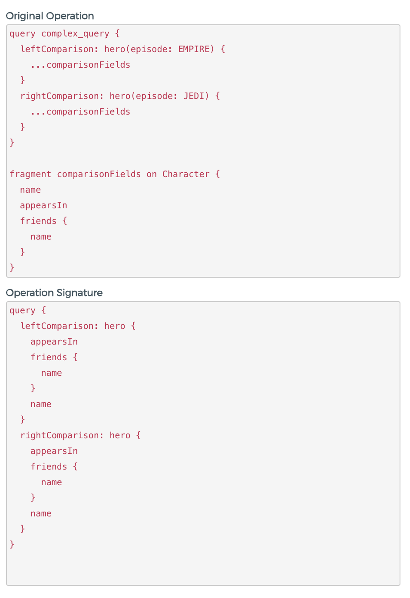

# GraphQL Operation Whitelist plugin for [Kong](https://konghq.com/)
Whitelist operations that your consumers can send to your GraphQL server.

## Plugin Description
Restrict access to a Service or a Route by whitelisting GraphQL Queries or Mutations (Subscriptions are not supported). 

## Terminology 
- plugin: a plugin executing actions inside Kong before or after a request has been proxied to the upstream API.
- Service: the Kong entity representing an external upstream API or microservice.
- Route: the Kong entity representing a way to map downstream requests to upstream services.
- Consumer: the Kong entity representing a developer or machine using the API. When using Kong, a Consumer only communicates with Kong which proxies every call to the said upstream API.
- Credential: a unique string associated with a Consumer, also referred to as an API key.
- upstream service: this refers to your own API/service sitting behind Kong, to which client requests are forwarded.
- Operation: query, mutation or subscription as described in the [GraphQL specifications](https://graphql.github.io/graphql-spec/June2018/#sec-Language.Operations)
- Signature: Functionally-equivalent operation can be written in various forms. In order to account for those variations, we generate a canonical form of the operation. We call this canonical form “signature”.

## Features

- Whitelist can contain Queries and Mutations.
- Operations included in the Whitelist are forwarded to the upstream GraphQL server.
- Whitelist is independent of schema
- Multiple functionally-equivalent operations are represented as a single entry in the Whitelist
- CRUD operations are available on the whitelist
- Whitelist is easy to visualize and contain operation metadata
- Whitelisting can be enforced on Service or Route level 
- Consumer credentials are use to store and manage Whitelist entries.


### Not supported
- Whitelist cannot contain Subscriptions
- A Subset of a Whitelisted Operation is not considered as a Whitelisted Operation
- There is not tooling support to extract a whitelist or operation from client codebase.


## Signature Generation
The rules to define the Signature are not final yet.

Current implementation will print the AST with the following rules:
* From Document, keep only the OperationDefinition targeting the current Operation
* From OperationDefinition: 
    - Keep OperationType
    - Drop OperationName
    - Drop VariableDefinitions
    - Drop Directives
    - Keep SelectionSet
* From SelectionSet
    - Keep Field
    - Replace FragmentSpread by FragmentDefinition 
    - Keep InlineFragment
    - Sort Selection elements in alphabetical order
* From Fields
    - Keep Alias
    - Keep Name
    - Drop Arguments
    - Drop Directives
    - Keep SelectionSet

An example of signature generated for a query using fragment definitions, aliases and arguments. It shows the inlining of fragment definition and reordering of the fields in the signature.




## Configuration

#### Enabling the plugin on a Service
Configure this plugin on a Service by making the following request:
```
$ curl -X POST http://kong:8001/services/{service}/plugins \
    --data "name=graphql-operation-whitelist"
```
`service`: the id or name of the Service that this plugin configuration will target.

#### Enabling the plugin on a Route
Configure this plugin on a Route with:
```
$ curl -X POST http://kong:8001/routes/{route_id}/plugins \
    --data "name=graphql-operation-whitelist"
```
`route_id`: the id of the Route that this plugin configuration will target.


#### Global plugins
All plugins can be configured using the http://kong:8001/plugins/ endpoint. A plugin which is not associated to any Service, Route or Consumer (or API, if you are using an older version of Kong) is considered "global", and will be run on every request.

#### Parameters
Here's a list of all the parameters which can be used in this plugin's configuration:

| Parameter |  | Default | Description |
| :---: | :---: | :---: | :---: |
| `name` |  |  | The name of the plugin to use, in this case `paseto`. |
| `service_id` |  |  | The id of the Service which this plugin will target. |
| `route_id` |  |  | The id of the Route which this plugin will target. |
| `enabled` |  | `true` | Whether this plugin will be applied. |

### Whitelist management
The plugin extends the Kong Admin API in a way that allows developer to add GraphQL operations to the whitelist by sending the operation directly to the admin API.

The Admin API supports standard GraphQL POST requests using the application/json content type and include a JSON-encoded body of the following form:

```
{
  "query": "...",
  "operationName": "..."
}
```

#### Add Operation to the Whitelist:
```
POST /consumers/[consumer-id]/gql-op-whitelist/
```

#### Remove Operation from the Whitelist:
```
DELETE /gql-op-whitelist/[operation-id]
```

For a GUI solution to manage the whitelist, check [this fork of Konga](https://github.com/elliatab/konga)

## Development environment

### Preparing the development environment

Once you have Vagrant installed, follow these steps to set up a development
environment for both Kong itself as well as for custom plugins. It will
install the development dependencies like the `busted` test framework.

```shell
# clone this repository
$ git clone https://github.com/rakutentech/kong-plugin-graphql-operation-whitelist
$ cd kong-plugin-graphql-operation-whitelist

# clone the Kong repo (inside the plugin one)
$ git clone https://github.com/Kong/kong

# build a box with a folder synced to your local Kong and plugin sources
$ vagrant up

# ssh into the Vagrant machine, and setup the dev environment
$ vagrant ssh
$ cd /kong
$ make dev

# To run this custom plugin, tell Kong to load it
$ export KONG_PLUGINS=bundled,graphql-operation-whitelist

# startup kong: while inside '/kong' call `kong` from the repo as `bin/kong`!
# we will also need to ensure that migrations are up to date
$ cd /kong
$ bin/kong migrations bootstrap
$ bin/kong start
```

This will tell Vagrant to mount your local Kong repository under the guest's
`/kong` folder, and the 'kong-plugin' repository under the
guest's `/kong-plugin` folder.

To verify Kong has loaded the plugin successfully, execute the following
command from the host machine:

```shell
$ curl http://localhost:8001
```
In the response you get, the plugins list should now contain an entry
"graphql-operation-whitelist" to indicate the plugin was loaded.

To start using the plugin, execute from the host:
```shell
# create an api that simply forward queries to Star Wars API, using a
# 'catch-all' setup with the `uris` field set to '/'
$ curl -i -X POST \
  --url http://localhost:8001/services/ \
  --data 'name=swapi' \
  --data 'url=https://swapi.apis.guru/'

$ curl -i -X POST \
  --url http://localhost:8001/services/swapi/routes \
  --data 'paths=/'

# add the graphql operation whitelist plugin to our new api
$ curl -i -X POST \
  --url http://localhost:8001/services/swapi/plugins \
  --data 'name=graphql-operation-whitelist'
```


## License

MIT License - see the [LICENSE](LICENSE) file for details

- This project uses the parser from https://github.com/bjornbytes/graphql-lua.

- The Development environment Vagrant file and documentation uses https://github.com/Kong/kong-vagrant